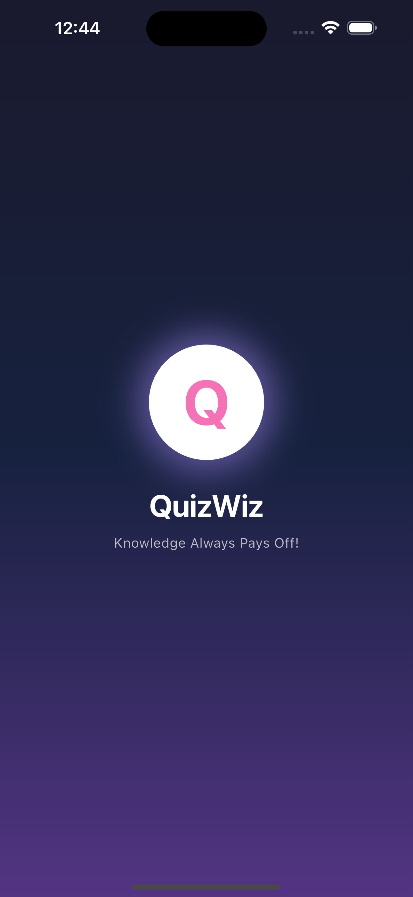
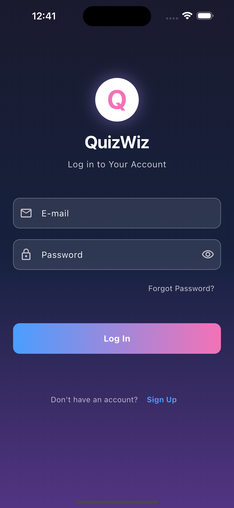
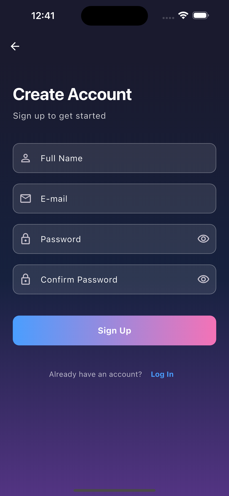
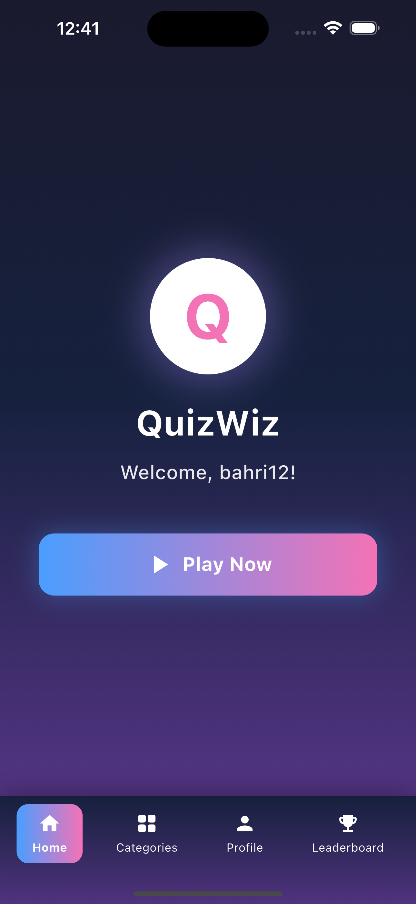
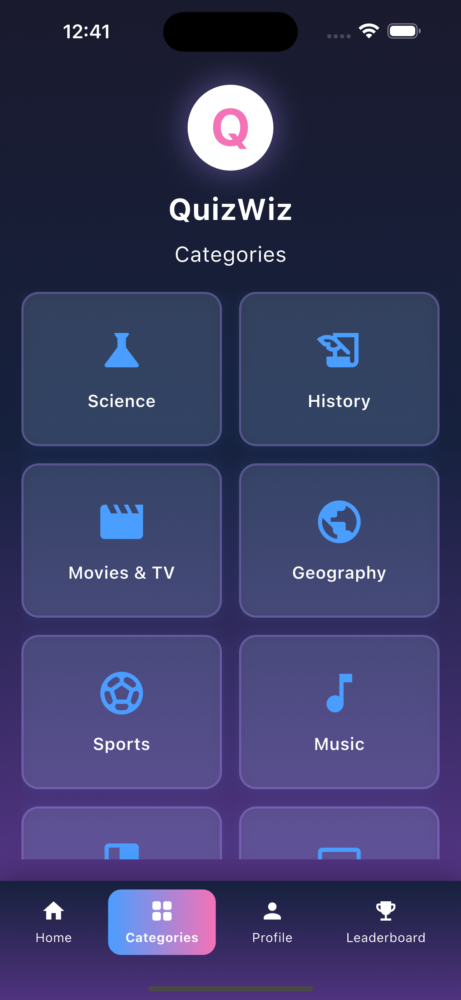
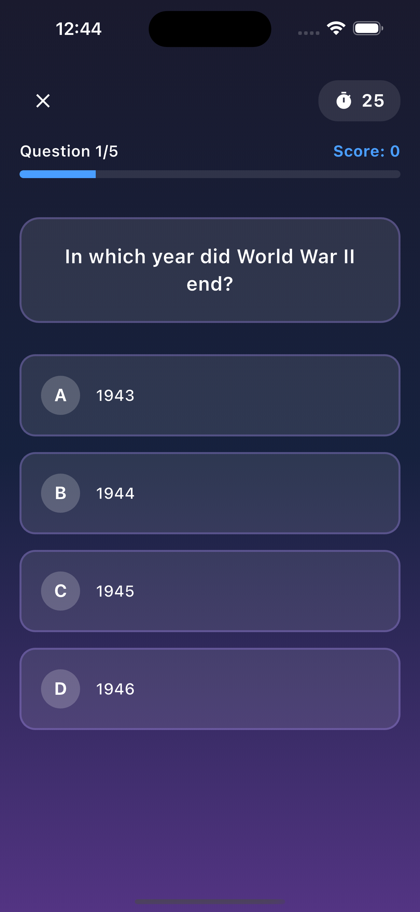
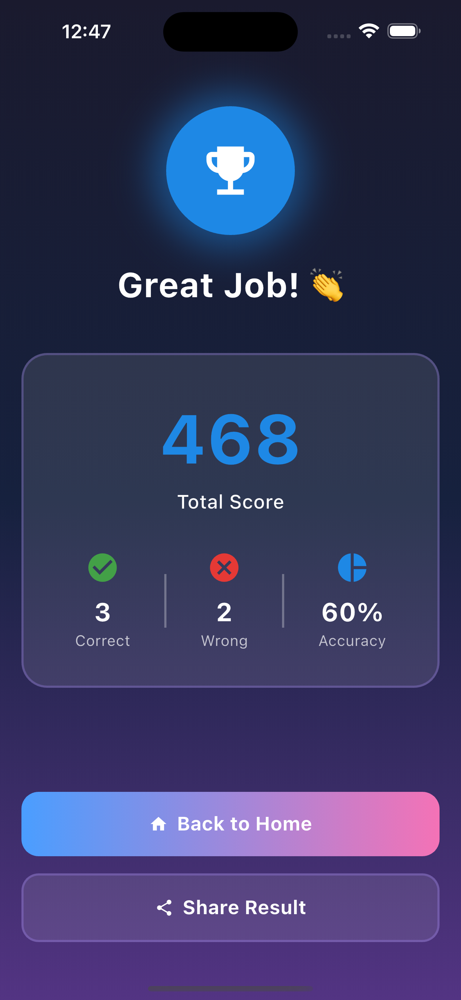
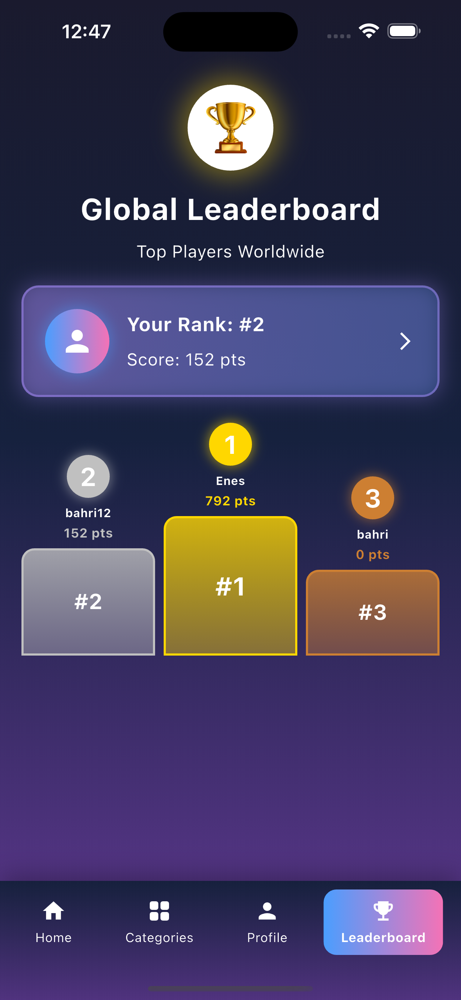
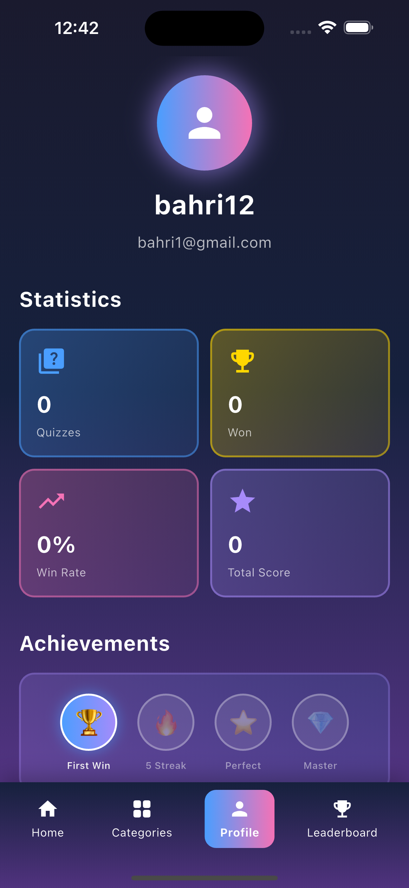

# 🎯 QuizWiz - Interactive Quiz Application

[](https://flutter.dev)
[](https://firebase.google.com)
[](https://dart.dev)

QuizWiz is a modern, feature-rich quiz application built with Flutter and Firebase. Test your knowledge across multiple categories, compete with others on the leaderboard, and track your progress!

## ✨ Features

### 🎮 Core Features

- **Multiple Quiz Categories** - Science, History, Geography, Movies, Sports, and more
- **Real-time Leaderboard** - Compete with players worldwide
- **Progress Tracking** - Track your quiz history and statistics
- **Achievement System** - Unlock badges as you progress
- **User Profiles** - Personalized user experience with detailed stats

### 🎨 UI/UX Features

- **Beautiful Animations** - Smooth transitions and interactive elements
- **Gradient Design** - Modern gradient-based UI
- **Responsive Layout** - Optimized for all screen sizes
- **Dark Theme** - Eye-friendly dark mode design

### 🔐 Authentication

- **Email/Password Authentication** - Secure user login
- **Google Sign-In** - Quick social authentication
- **Password Reset** - Easy account recovery

---

## 📱 Screenshots

### Authentication Screens

<table>
  <tr>
    <td></td>
    <td></td>
    <td></td>
  </tr>
  <tr>
    <td align="center"><b>Splash Screen</b></td>
    <td align="center"><b>Login</b></td>
    <td align="center"><b>Sign Up</b></td>
  </tr>
</table>

### Main Application

<table>
  <tr>
    <td></td>
    <td></td>
    <td></td>
  </tr>
  <tr>
    <td align="center"><b>Home Screen</b></td>
    <td align="center"><b>Categories</b></td>
    <td align="center"><b>Quiz Screen</b></td>
  </tr>
</table>

### Results & Profile

<table>
  <tr>
    <td></td>
    <td></td>
    <td></td>
  </tr>
  <tr>
    <td align="center"><b>Quiz Results</b></td>
    <td align="center"><b>Leaderboard</b></td>
    <td align="center"><b>Profile</b></td>
  </tr>
</table>

---

## 🏗️ Architecture

This project follows **Clean Architecture** principles for better separation of concerns, testability, and maintainability.

```
lib/
├── core/                           # Shared resources
│   ├── constants/                  # App-wide constants
│   │   └── app_constants.dart
│   ├── theme/                      # Theme configuration
│   │   ├── app_colors.dart
│   │   └── app_theme.dart
│   └── utils/                      # Utility classes
│
├── data/                           # Data Layer
│   ├── model/                      # Data models
│   │   ├── quiz_model.dart
│   │   ├── quiz_result_model.dart
│   │   └── user_model.dart
│   ├── datasources/                # Data sources
│   │   └── remote/
│   │       └── firestore_service.dart
│   └── sample/                     # Sample/mock data
│       └── sample_quizzes.dart
│
├── domain/                         # Business Logic Layer
│   ├── repositories/               # Repository interfaces
│   └── usecases/                   # Business use cases
│       ├── auth/
│       └── quiz/
│
└── presentation/                   # Presentation Layer
    ├── providers/                  # State management
    │   ├── auth_provider.dart
    │   └── quiz_provider.dart
    ├── screens/                    # UI screens
    │   ├── auth/
    │   ├── home/
    │   ├── categories/
    │   ├── quiz/
    │   ├── profile/
    │   └── leaderboard/
    └── widgets/                    # Reusable widgets
        ├── custom_stat_card.dart
        ├── achievement_badge.dart
        ├── setting_list_item.dart
        └── category_card.dart
```

---

## 🛠️ Tech Stack

### Frontend

- **Flutter** - UI framework
- **Provider** - State management
- **Dart** - Programming language

### Backend & Services

- **Firebase Authentication** - User authentication
- **Cloud Firestore** - NoSQL database
- **Firebase Core** - Firebase initialization

### Development Tools

- **Flutter Lints** - Code quality
- **Flutter Dotenv** - Environment variables

---

## 🚀 Getting Started

### Prerequisites

```bash
Flutter SDK: >=3.0.0
Dart SDK: >=3.0.0
```

### Installation

1. **Clone the repository**

   ```bash
   git clone https://github.com/cevizenes/QuizWiz.git
   cd quizwiz
   ```

2. **Install dependencies**

   ```bash
   flutter pub get
   ```

3. **Firebase Setup**

   Create a `.env` file in the root directory:

   ```env
   # Add your environment variables here
   ```

4. **Run the app**
   ```bash
   flutter run
   ```

---

## 🔥 Firebase Configuration

### Required Services

- ✅ Firebase Authentication (Email/Password, Google Sign-In)
- ✅ Cloud Firestore (Database)

### Firestore Collections

#### `users`

```javascript
{
  "displayName": string,
  "email": string,
  "photoUrl": string?,
  "totalQuizzes": number,
  "quizzesWon": number,
  "totalScore": number,
  "rank": number,
  "achievements": array,
  "createdAt": timestamp
}
```

#### `quiz_results`

```javascript
{
  "userId": string,
  "quizId": string,
  "category": string,
  "score": number,
  "correctAnswers": number,
  "totalQuestions": number,
  "timeTaken": number,
  "completedAt": timestamp
}
```

### Required Indexes

Create composite indexes in Firebase Console:

1. **users collection**

   - Fields: `totalScore` (Descending), `__name__` (Descending)

2. **quiz_results collection**
   - Fields: `userId` (Ascending), `completedAt` (Descending)

---

## 📊 Features in Detail

### 🎯 Quiz System

- **12 Categories** - Diverse topics to test your knowledge
- **Timed Questions** - 30 seconds per question
- **Score System** - Base points + time bonus
- **Progress Tracking** - Visual progress indicator

### 🏆 Leaderboard

- **Global Rankings** - See where you stand
- **Top 10 Players** - Podium display for top 3
- **Real-time Updates** - Automatic refresh
- **User Rank** - Your position in the rankings

### 👤 User Profile

- **Statistics Dashboard** - Total quizzes, wins, win rate, total score
- **Achievement Badges** - Unlock as you progress
- **Quiz History** - Recent quiz results
- **Settings** - Profile management

---

## 🎨 Design System

### Color Palette

- **Primary**: Gradient (Blue to Purple)
- **Secondary**: Light Blue, Light Pink
- **Background**: Dark Blue shades
- **Accent**: Gold, Green, Purple

### Typography

- **Headings**: Bold, 24-36px
- **Body**: Regular, 14-16px
- **Captions**: Light, 10-12px

### Components

- **Cards** - Rounded corners, gradient borders
- **Buttons** - Gradient backgrounds, shadow effects
- **Animations** - Elastic, ease-out curves

---

## 📱 State Management

The app uses **Provider** for state management with two main providers:

### AuthProvider

- User authentication state
- User data management
- Sign in/out functionality

### QuizProvider

- Quiz data fetching
- Current quiz state
- Answer tracking
- Score calculation

## 📦 Dependencies

```yaml
dependencies:
  flutter:
    sdk: flutter

  # State Management
  provider: ^6.1.2

  # Firebase
  firebase_core: ^3.15.2
  firebase_auth: ^5.7.0
  cloud_firestore: ^5.6.12
  google_sign_in: ^6.3.0

  # Environment
  flutter_dotenv: ^5.2.1

dev_dependencies:
  flutter_test:
    sdk: flutter
  flutter_lints: ^5.0.0
```

<div align="center">
  <p>Made with using Flutter</p>
  <p>Star this repo if you like it!</p>
</div>
